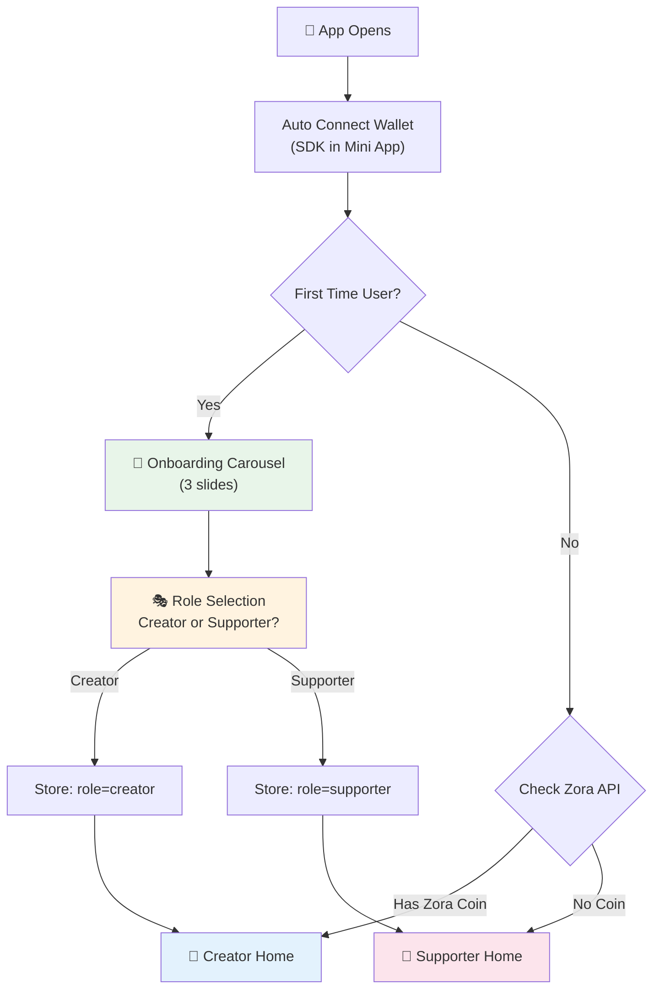
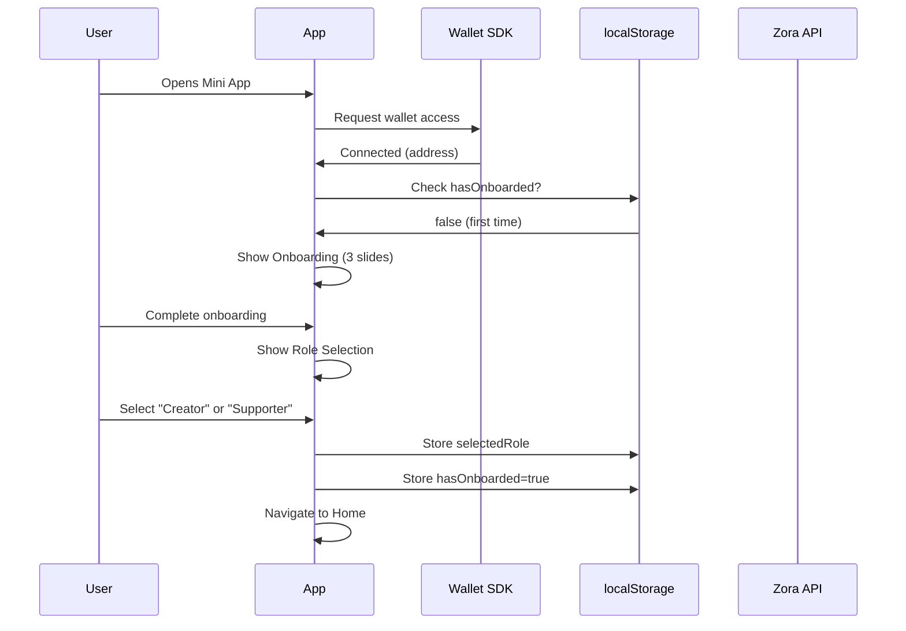
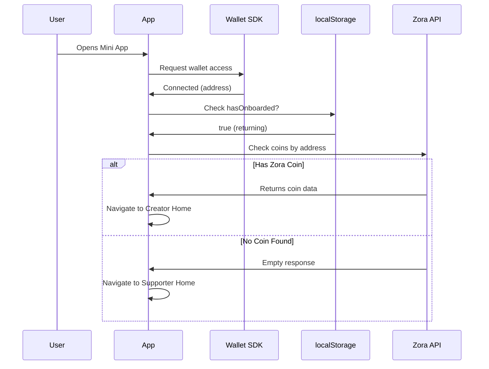
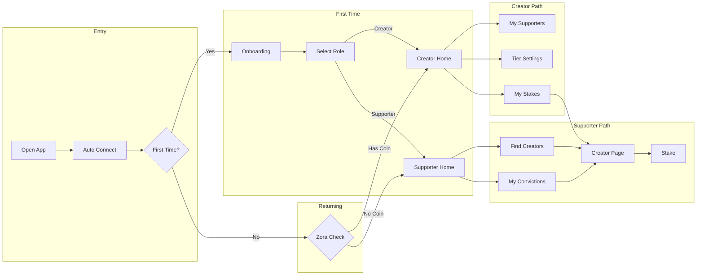

# Nakama App - User Flow Documentation

## Overview

Nakama is a **Farcaster Mini App** that allows users to stake creator coins to show their "conviction" and earn tiered badges. The app runs on **Base mainnet**.

---

## Finalized User Flow

### Entry Flow (All Users)



### First-Time User Flow (Detailed)



### Returning User Flow (Detailed)



---

## Page Structure (New)

### 1. Onboarding Page (`/onboarding`)
New page for first-time users.

```
┌─────────────────────────────────────┐
│                                     │
│           [Slide 1/3]               │
│                                     │
│             🪙                      │
│                                     │
│    Buy Your Favorite Creator's      │
│              Coin                   │
│                                     │
│    Get tokens from creators you     │
│    believe in on Base               │
│                                     │
│                                     │
│         ● ○ ○    [Next →]           │
│                                     │
└─────────────────────────────────────┘

┌─────────────────────────────────────┐
│                                     │
│           [Slide 2/3]               │
│                                     │
│             🔒                      │
│                                     │
│       Lock to Show Conviction       │
│                                     │
│    Stake tokens for 7-90+ days      │
│    to prove you're a true fan       │
│                                     │
│                                     │
│         ○ ● ○    [Next →]           │
│                                     │
└─────────────────────────────────────┘

┌─────────────────────────────────────┐
│                                     │
│           [Slide 3/3]               │
│                                     │
│             🏆                      │
│                                     │
│      Earn Badges & Perks            │
│                                     │
│    Claim soulbound NFTs and get     │
│    exclusive creator access         │
│                                     │
│                                     │
│      ○ ○ ●    [Get Started →]       │
│                                     │
└─────────────────────────────────────┘
```

### 2. Role Selection Page (`/select-role`)
After onboarding, user chooses their primary role.

```
┌─────────────────────────────────────┐
│                                     │
│        How will you use Nakama?     │
│                                     │
│  ┌─────────────────────────────┐    │
│  │       🎨 I'm a Creator      │    │
│  │                             │    │
│  │   I have a coin on Zora     │    │
│  │   and want to see my        │    │
│  │   supporters & manage tiers │    │
│  └─────────────────────────────┘    │
│                                     │
│  ┌─────────────────────────────┐    │
│  │      💪 I'm a Supporter     │    │
│  │                             │    │
│  │   I want to find creators   │    │
│  │   to support and earn       │    │
│  │   conviction badges         │    │
│  └─────────────────────────────┘    │
│                                     │
│        (You can do both later!)     │
│                                     │
└─────────────────────────────────────┘
```

### 3. Creator Home (`/creator-home`)
Dashboard for creators to manage their supporters.

```
┌─────────────────────────────────────┐
│ ← Back              Creator Home    │
├─────────────────────────────────────┤
│                                     │
│  ┌─────────────────────────────┐    │
│  │  [Avatar]  @username         │    │
│  │  $TOKEN • 245 supporters     │    │
│  │  Market Cap: $12,345         │    │
│  └─────────────────────────────┘    │
│                                     │
│  ┌───────────┐ ┌───────────┐        │
│  │    24     │ │     8     │        │
│  │  Legends  │ │   Gold    │        │
│  └───────────┘ └───────────┘        │
│                                     │
│  ───── Quick Actions ─────          │
│                                     │
│  [👥 Top Supporters]                │
│  [⚙️ Tier Settings]                 │
│  [🔒 My Stakes (as supporter)]      │
│                                     │
│  ───── Top Supporters ─────         │
│                                     │
│  1. @alice    Legend 🏆             │
│  2. @bob      Gold 🥇               │
│  3. @carol    Silver 🥈             │
│                                     │
└─────────────────────────────────────┘
```

### 4. Supporter Home (`/` - replaces current home)
Dashboard for supporters to find creators and manage stakes.

```
┌─────────────────────────────────────┐
│                     Conviction Vault│
├─────────────────────────────────────┤
│                                     │
│  ┌─────────────────────────────┐    │
│  │ 🔒 Show Your Conviction     │    │
│  │                             │    │
│  │ Stake creator coins to      │    │
│  │ prove your support          │    │
│  └─────────────────────────────┘    │
│                                     │
│  ┌───────────┐ ┌───────────┐        │
│  │     3     │ │     1     │        │
│  │ Positions │ │  Legend   │        │
│  └───────────┘ └───────────┘        │
│                                     │
│  ───── Quick Actions ─────          │
│                                     │
│  [🔍 Find Creators]                 │
│  [🏆 My Convictions]                │
│                                     │
│  ───── Your Positions ─────         │
│                                     │
│  $ZORA   Gold 🥇   30d remaining    │
│  $DEGEN  Legend 🏆  Unlocked        │
│                                     │
│  ───── Trending Creators ─────      │
│  (future feature)                   │
│                                     │
└─────────────────────────────────────┘
```

### 5. Find Creators Page (`/find-creators`)
New dedicated page for discovering creators (replaces `/creator/0x0...`).

```
┌─────────────────────────────────────┐
│ ← Back              Find Creators   │
├─────────────────────────────────────┤
│                                     │
│  ┌─────────────────────────────┐    │
│  │ 🔍 Search by name or address│    │
│  └─────────────────────────────┘    │
│                                     │
│  ───── Or Enter Token Address ───── │
│                                     │
│  ┌─────────────────────────────┐    │
│  │ 0x...                       │    │
│  └─────────────────────────────┘    │
│                                     │
│  [View Creator →]                   │
│                                     │
│  ───── Popular Creators ─────       │
│  (future: trending list)            │
│                                     │
└─────────────────────────────────────┘
```

---

## Storage Schema

### localStorage Keys

```typescript
interface NakamaStorage {
  // Onboarding state
  hasOnboarded: boolean;           // true after role selection
  selectedRole: 'creator' | 'supporter' | null;
  onboardingCompletedAt: string;   // ISO date
  
  // User detection cache
  detectedCreatorToken: string | null;  // cached Zora coin address
  lastCreatorCheck: string;             // ISO date (cache for 1 hour)
}
```

---

## Auto-Detection Logic

### Zora API Check

```typescript
async function detectCreatorStatus(address: string): Promise<{
  isCreator: boolean;
  coin: ZoraCoinData | null;
}> {
  // 1. Check cache first (valid for 1 hour)
  const cached = localStorage.getItem('detectedCreatorToken');
  const lastCheck = localStorage.getItem('lastCreatorCheck');
  
  if (cached && lastCheck) {
    const age = Date.now() - new Date(lastCheck).getTime();
    if (age < 60 * 60 * 1000) { // 1 hour
      return { isCreator: !!cached, coin: cached ? await getZoraCoin(cached) : null };
    }
  }
  
  // 2. Query Zora API for coins created by this address
  const coins = await getZoraCoinsCreatedBy(address);
  
  // 3. Cache result
  if (coins.length > 0) {
    localStorage.setItem('detectedCreatorToken', coins[0].address);
  } else {
    localStorage.removeItem('detectedCreatorToken');
  }
  localStorage.setItem('lastCreatorCheck', new Date().toISOString());
  
  return {
    isCreator: coins.length > 0,
    coin: coins[0] || null
  };
}
```

---

## Navigation Flow Summary



---

## Implementation Checklist

### New Pages to Create
- [ ] `/onboarding` - 3-slide carousel
- [ ] `/select-role` - Role selection
- [ ] `/creator-home` - Creator dashboard
- [ ] `/find-creators` - Dedicated search page

### Pages to Modify
- [ ] `/` (home) - Becomes Supporter Home
- [ ] `/creator/[token]` - Keep as-is (detail page)
- [ ] `/my-convictions` - Keep as-is
- [ ] `/creator-settings` - Keep, link from Creator Home

### New Components
- [ ] `OnboardingCarousel` - Swipeable slides
- [ ] `RoleSelector` - Creator/Supporter cards
- [ ] `CreatorDashboard` - Stats + quick actions
- [ ] `ZoraCreatorCheck` - Auto-detection hook

### New API/Hooks
- [ ] `useCreatorDetection()` - Check Zora for user's coins
- [ ] `useOnboardingState()` - Manage localStorage flags

### Entry Point Logic
- [ ] Add routing logic in `layout.tsx` or `MiniAppProvider`
- [ ] Redirect based on onboarding + detection state

---

## Add Mini App Prompt

Trigger **after first successful stake**, not at app open:

```typescript
// In creator page, after stake success
useEffect(() => {
  if (stakeSuccess) {
    // First stake completed - now prompt to add
    actions.addMiniApp();
    
    // Also prompt to share
    actions.composeCast(...);
  }
}, [stakeSuccess]);
```

---

## Reminder for Later

> **TODO:** Update onboarding content (copy + images) after flow is implemented.

---

## Questions Resolved

| Question | Decision |
|----------|----------|
| Role selection | Hard selection on first visit |
| Returning users | Auto-detect via Zora API |
| Creator detection | Zora API - check coins by address |
| Add mini app | After first stake |
| Onboarding content | Later, after flow is fixed |
